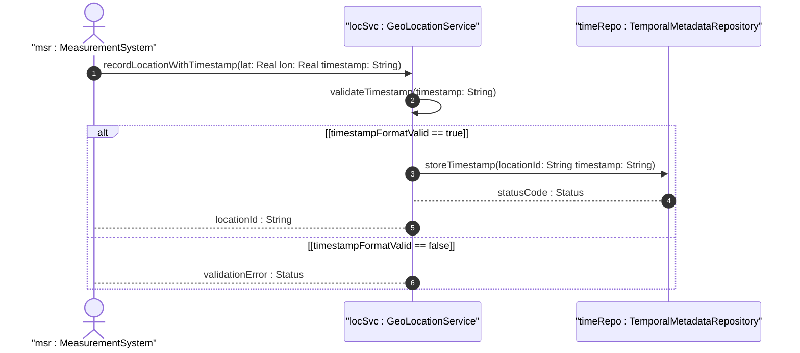

# User Story: Record Location Measurement Timestamp

## Parent Epic
- [ ] [#8](https://github.com/gintatkinson/3dgs-011/blob/main/docs/epics/epic-02-position-coordinates-motion-tracking.md) - Geographic Location: Position Coordinates and Motion Tracking (semantic linkage: this user story captures measurement timing within the position and motion epic)

## Domain Object Mapping
- **Primary Domain Objects:** TemporalMetadata, Timestamp
- **Actor/Role:** MeasurementSystem

## BDD Scenario (OOA/OOD Realization)
**As a** MeasurementSystem
**I want to** record the timestamp when a geo-location measurement was taken
**So that** downstream consumers can correlate the location with a specific point in time

**Given** a newly acquired geo-location measurement
**When** the MeasurementSystem records the measurement with timestamp "2024-01-15T10:30:00Z"
**Then** the system stores the timestamp as the reference time for the location data

## UML Sequence Diagram

## Operational Context
The timestamp defines the reference time when the location was recorded. It uses the yang:date-and-time type from RFC 6991. The precision of the timestamp can be arbitrarily large as it uses a string representation encompassing all representable values.

## Required Features Matrix
- [ ] [#6](https://github.com/gintatkinson/3dgs-011/blob/main/docs/features/feat-06-temporal-location-lifecycle.md) - Manage Temporal Location Lifecycle and Expiration (semantic linkage: the timestamp is a temporal metadata attribute)
- [ ] [#3](https://github.com/gintatkinson/3dgs-011/blob/main/docs/features/feat-03-ellipsoid-coordinate-positioning.md) - Specify Ellipsoid Geodetic Coordinates (semantic linkage: location coordinates are recorded alongside the timestamp)

## Source References
Structural Schema: ietf-geo-location@2022-02-11.yang — `timestamp` leaf
Normative Specification: RFC 9179 Section 2.5
