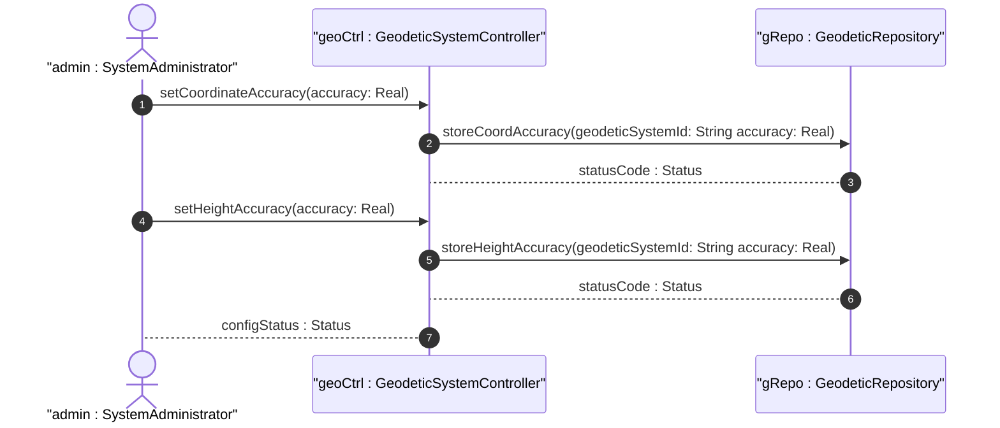

# User Story: Configure Coordinate Accuracy and Height Accuracy

## Parent Epic
- [ ] [#7](https://github.com/gintatkinson/3dgs-011/blob/main/docs/epics/epic-01-reference-frame-geodetic-system.md) - Geographic Location: Reference Frame and Geodetic System Definition (semantic linkage: this user story configures accuracy parameters within the reference frame epic)

## Domain Object Mapping
- **Primary Domain Objects:** GeodeticSystem, CoordAccuracy, HeightAccuracy
- **Actor/Role:** SystemAdministrator

## BDD Scenario (OOA/OOD Realization)
**As a** SystemAdministrator
**I want to** configure the coordinate accuracy and height accuracy for a geodetic system
**So that** the precision of location measurements is explicitly documented and overrides default values

**Given** a geodetic-system with a defined geodetic-datum
**When** the SystemAdministrator sets coord-accuracy to 0.5 and height-accuracy to 0.3 meters
**Then** the system stores the accuracy values, documenting the precision of the location data

## UML Sequence Diagram

## Operational Context
When coord-accuracy or height-accuracy are specified, they override the defaults implied by the geodetic-datum value. Coord-accuracy indicates how precisely the coordinates have been determined with respect to the coordinate system. Height-accuracy is not used with Cartesian coordinates.

## Required Features Matrix
- [ ] [#2](https://github.com/gintatkinson/3dgs-011/blob/main/docs/features/feat-02-geodetic-datum-accuracy.md) - Configure Geodetic Datum and Coordinate Accuracy (semantic linkage: this user story directly exercises the accuracy configuration feature)

## Source References
Structural Schema: ietf-geo-location@2022-02-11.yang — `coord-accuracy` leaf, `height-accuracy` leaf
Normative Specification: RFC 9179 Section 2.1
