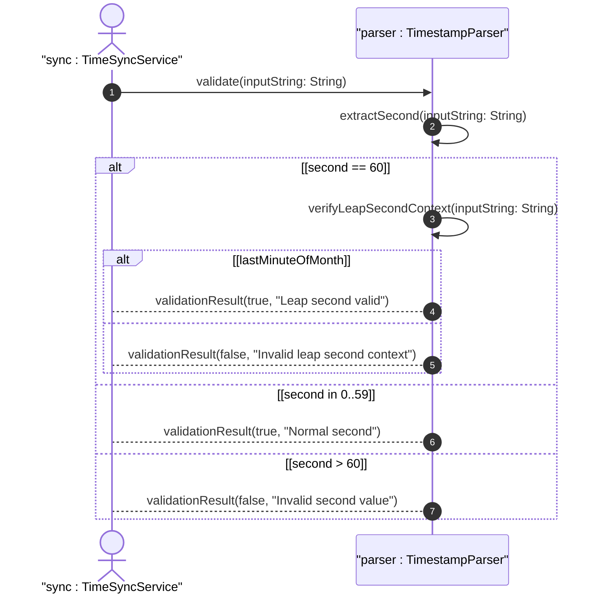

# User Story: Handle Leap Seconds in Timestamp Processing

## Parent Epic
- [ ] #38 - Common YANG Data Types: Date-Time and Timestamp Types

## Domain Object Mapping
- **Primary Domain Objects:** date-and-time, time
- **Actor/Role:** Time Synchronization Service

## BDD Scenario
**As a** Time Synchronization Service
**I want to** validate and preserve leap second values (second = 60) in timestamps
**So that** I can represent UTC leap seconds per RFC 3339

## UML Sequence Diagram

## Required Features Matrix
- [ ] #26 - Represent Date and Time Values with Time Zone Offset (semantic linkage: leap second validation in datetime parsing)

## Source References
Structural Schema: ietf-yang-types.yang
Normative Specification: RFC 9911, Section 3
