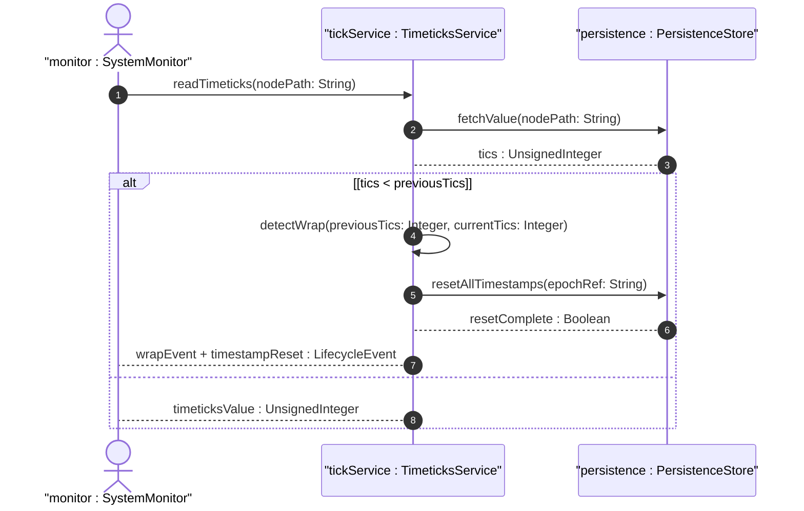
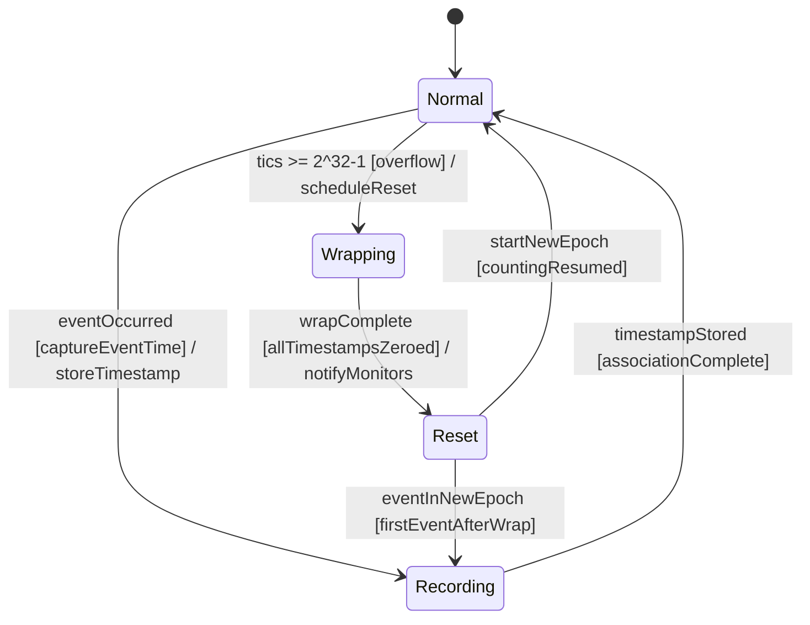

# User Story: Detect and Manage Timeticks Wrap and Timestamp Reset Lifecycle

## Parent Epic
- [ ] #38 - Common YANG Data Types: Date-Time and Timestamp Types

## Domain Object Mapping
- **Primary Domain Objects:** timeticks, timestamp
- **Actor/Role:** System Monitor / Uptime Tracker

## BDD Scenario
**As a** System Monitor
**I want to** detect when timeticks wrap (modulo 2^32) and reset all associated timestamp values to zero
**So that** the timekeeping system correctly represents uptime and event timing across the ~497 day wrap cycle

## UML Sequence Diagram

## UML State Machine Diagram

## Required Features Matrix
- [ ] #28 - Represent System Timeticks and Epoch Timestamps (semantic linkage: lifecycle story for timeticks wrap and timestamp reset)

## Source References
Structural Schema: ietf-yang-types.yang
Normative Specification: RFC 9911, Section 3
