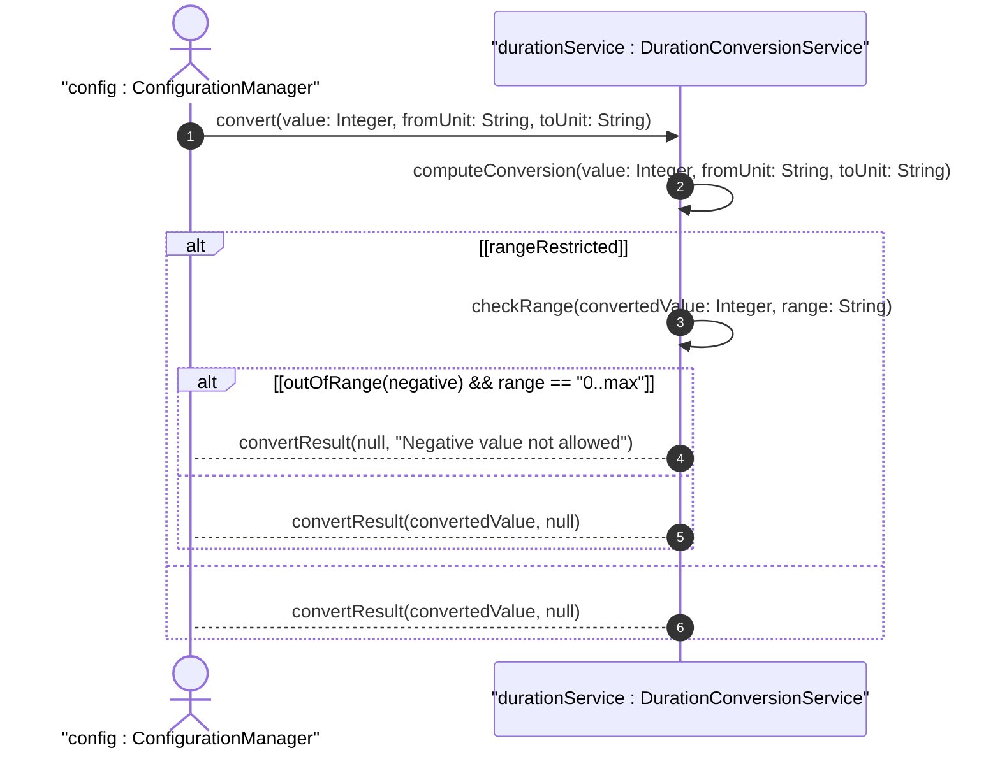

# User Story: Convert and Validate Coarse Time Duration Units

## Parent Epic
- [ ] #39 - Common YANG Data Types: Time Duration Measurement Types

## Domain Object Mapping
- **Primary Domain Objects:** hours32, minutes32, seconds32
- **Actor/Role:** Configuration Manager / Timeout Handler

## BDD Scenario
**As a** Configuration Manager
**I want to** convert between hours, minutes, and seconds duration units and validate range constraints
**So that** I can store and retrieve duration values in the appropriate unit with overflow protection

## UML Sequence Diagram

## Required Features Matrix
- [ ] #29 - Represent Coarse Time Duration Values (semantic linkage: behavioral conversion of coarse duration units)

## Source References
Structural Schema: ietf-yang-types.yang
Normative Specification: RFC 9911, Section 3
