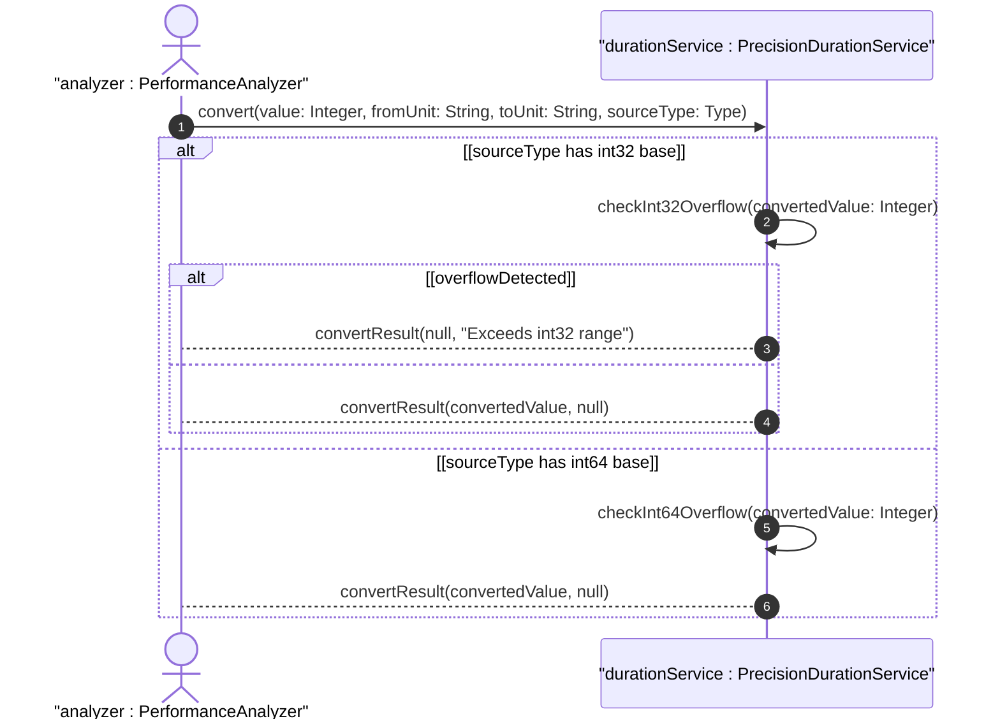

# User Story: Convert and Validate Sub-Second Time Duration Units

## Parent Epic
- [ ] #39 - Common YANG Data Types: Time Duration Measurement Types

## Domain Object Mapping
- **Primary Domain Objects:** centiseconds32, milliseconds32, microseconds32, microseconds64, nanoseconds32, nanoseconds64
- **Actor/Role:** Performance Analyzer / Precision Timer

## BDD Scenario
**As a** Performance Analyzer
**I want to** convert between sub-second duration units (centiseconds through nanoseconds) with range validation
**So that** I can measure and report precision timing values within representable bounds

## UML Sequence Diagram

## Required Features Matrix
- [ ] #30 - Represent Sub-Second Time Duration Values (semantic linkage: behavioral precision duration conversion)
- [ ] #31 - Represent High-Resolution Nanosecond Duration Values (semantic linkage: nanosecond precision duration handling)

## Source References
Structural Schema: ietf-yang-types.yang
Normative Specification: RFC 9911, Section 3
