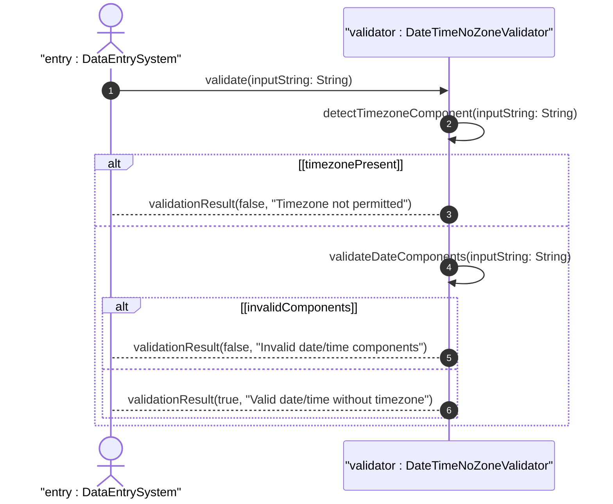

# User Story: Validate Date and Time Values Without Timezone Offset

## Parent Epic
- [ ] #38 - Common YANG Data Types: Date-Time and Timestamp Types

## Domain Object Mapping
- **Primary Domain Objects:** date-no-zone, time-no-zone
- **Actor/Role:** Data Entry System / Local Time Application

## BDD Scenario
**As a** Data Entry System
**I want to** validate date and time values that explicitly exclude timezone offset information
**So that** I can represent local dates and times where timezone context is handled separately

## UML Sequence Diagram

## Required Features Matrix
- [ ] #27 - Represent Date and Time Values Without Time Zone (semantic linkage: behavioral validation of timezone-free date/time)

## Source References
Structural Schema: ietf-yang-types.yang
Normative Specification: RFC 9911, Section 3
