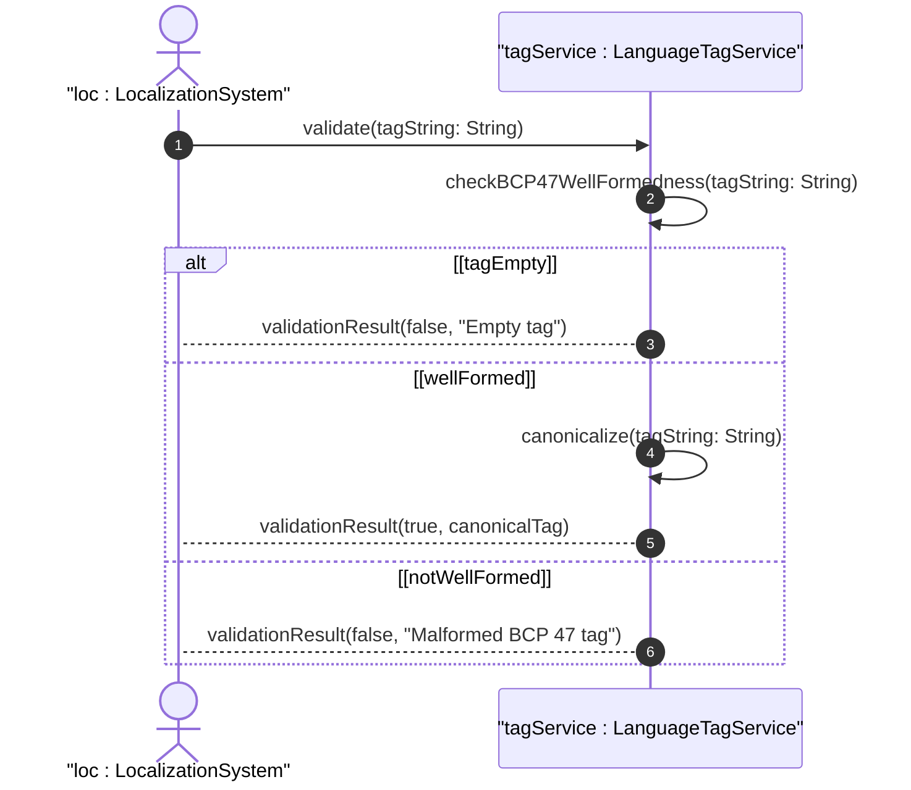

# User Story: Validate Language Tag Compliance with BCP 47

## Parent Epic
- [ ] #40 - Common YANG Data Types: String and Identifier Types

## Domain Object Mapping
- **Primary Domain Objects:** language-tag
- **Actor/Role:** Localization System / Content Manager

## BDD Scenario
**As a** Localization System
**I want to** validate language tags against RFC 5646 (BCP 47) well-formedness rules
**So that** I ensure language identifiers conform to the standard tag syntax

## UML Sequence Diagram

## Required Features Matrix
- [ ] #34 - Represent Language Tag Values (semantic linkage: behavioral BCP 47 language tag validation)

## Source References
Structural Schema: ietf-yang-types.yang
Normative Specification: RFC 9911, Section 3
