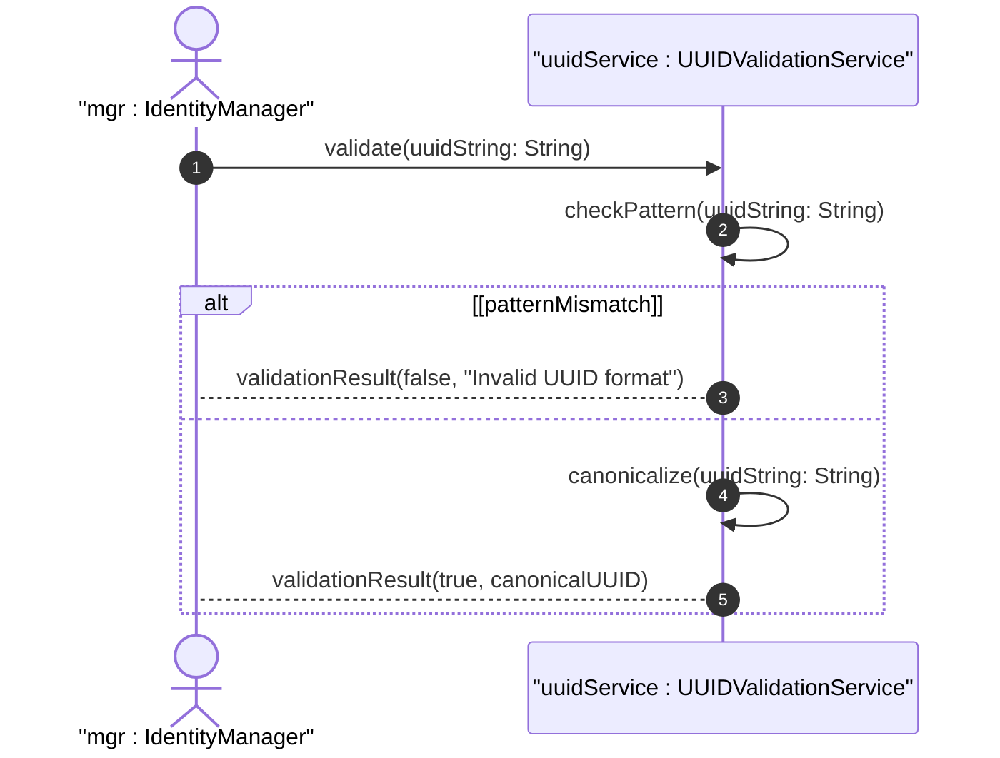

# User Story: Validate UUID Format Compliance with RFC 9562

## Parent Epic
- [ ] #40 - Common YANG Data Types: String and Identifier Types

## Domain Object Mapping
- **Primary Domain Objects:** uuid
- **Actor/Role:** Identity Manager / System Integrator

## BDD Scenario
**As a** Identity Manager
**I want to** validate UUID string format and canonicalize to lowercase
**So that** I ensure globally unique identifiers conform to RFC 9562 format

## UML Sequence Diagram

## Required Features Matrix
- [ ] #33 - Represent Universal Unique Identifier Values (semantic linkage: behavioral UUID format validation)

## Source References
Structural Schema: ietf-yang-types.yang
Normative Specification: RFC 9911, Section 3
