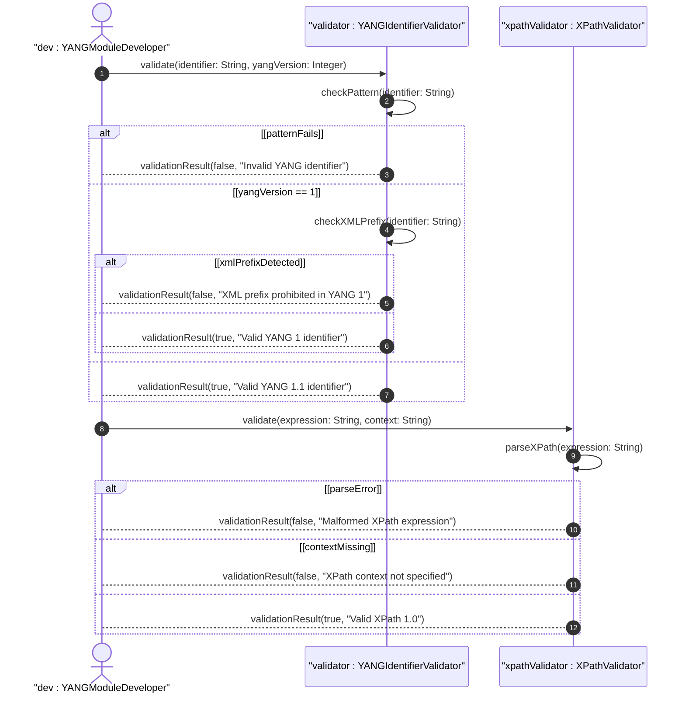

# User Story: Validate YANG Identifier and XPath Expression Format

## Parent Epic
- [ ] #40 - Common YANG Data Types: String and Identifier Types

## Domain Object Mapping
- **Primary Domain Objects:** yang-identifier, xpath1.0
- **Actor/Role:** YANG Module Developer / Schema Validator

## BDD Scenario
**As a** YANG Module Developer
**I want to** validate YANG identifiers per RFC 7950 Section 14 rules and XPath 1.0 expressions
**So that** I ensure identifier names and XPath expressions conform to YANG and XPath syntax

## UML Sequence Diagram

## Required Features Matrix
- [ ] #35 - Represent YANG Identifier and XPath Expression Values (semantic linkage: behavioral validation of YANG identifiers and XPath)

## Source References
Structural Schema: ietf-yang-types.yang
Normative Specification: RFC 9911, Section 3
