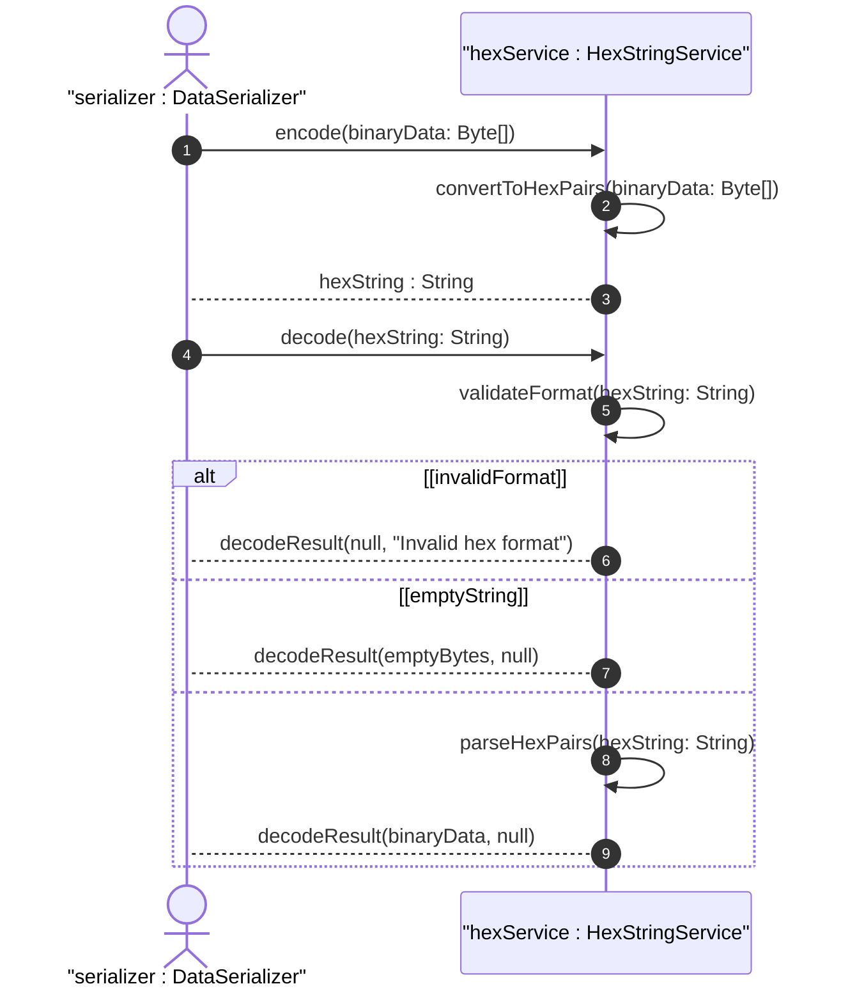

# User Story: Encode and Decode Hexadecimal String Octet Sequences

## Parent Epic
- [ ] #40 - Common YANG Data Types: String and Identifier Types

## Domain Object Mapping
- **Primary Domain Objects:** hex-string
- **Actor/Role:** Data Serializer / Binary Data Handler

## BDD Scenario
**As a** Data Serializer
**I want to** encode binary data to hex-string format and decode hex-string back to binary
**So that** I can represent arbitrary octet sequences as colon-separated hex pairs

## UML Sequence Diagram

## Required Features Matrix
- [ ] #32 - Represent Hexadecimal String Octet Sequences (semantic linkage: behavioral hex-string encode/decode)

## Source References
Structural Schema: ietf-yang-types.yang
Normative Specification: RFC 9911, Section 3
